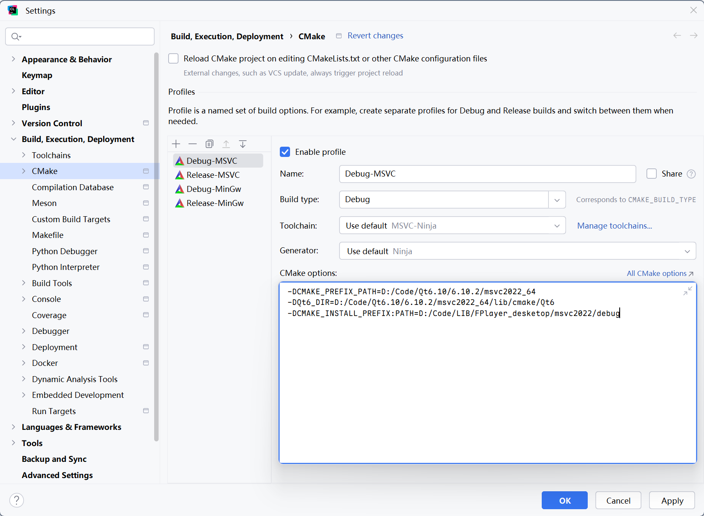
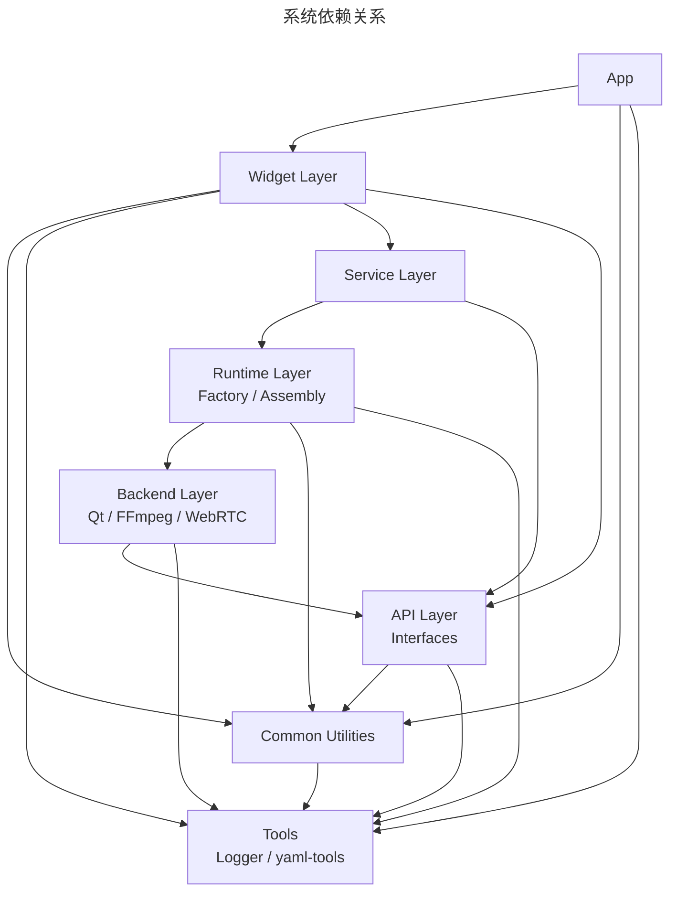

<p align="center">
  
</p>

<p align="center">
  
</p>

```
                            ███████╗██████╗ ██╗      █████╗ ██╗   ██╗███████╗██████╗ 
                            ██╔════╝██╔══██╗██║     ██╔══██╗╚██╗ ██╔╝██╔════╝██╔══██╗
                            █████╗  ██████╔╝██║     ███████║ ╚████╔╝ █████╗  ██████╔╝
                            ██╔══╝  ██╔═══╝ ██║     ██╔══██║  ╚██╔╝  ██╔══╝  ██╔══██╗
                            ██║     ██║     ███████╗██║  ██║   ██║   ███████╗██║  ██║
                            ╚═╝     ╚═╝     ╚══════╝╚═╝  ╚═╝   ╚═╝   ╚══════╝╚═╝  ╚═╝
````


# 产品

## 基本介绍

**跨平台局域网多输入源的流媒体播放系统**

1. 桌面端，支持播放本地视频、捕获摄像头画面(包括虚拟摄像头)、屏幕共享，局域网环境下进行推流与拉流。
2. 安卓端，仅播放功能，但是局域网内可以实现拉流。

## 详细介绍


# 技术

## 技术栈


## 技术选型

>
> https://chatgpt.com/g/g-p-6971d5acf0c88191928b4001b06a20ae/c/69a55146-ec0c-83a8-9cb0-c43f0ccfbd91
> https://chatgpt.com/share/69a554d8-d534-8007-afc1-30ee6c803f77

两个方向：

1. GStreamer全家桶(流媒体处理流水线框架 -> 可以用它构建从采集、解码、处理、编码、封装、传输到播放的完整音视频系统)【适用于更强大的应用场景，如浏览器观看/NAT穿透/抄超低延迟互动(本质还是使用了GStreamer中的WebRTC)】
2. Qt/ffmpeg 后端 + ffmpeg推拉流(RTSP/SRT/RTMP) 【适用于局域网推拉流】

> 目前使用2，后面遇到性能瓶颈，再按照方向1进行升级

## 依赖

| 依赖 | 版本   |
| ---- | ------ |
| C++  | 17     |
| Qt   | 6.10.2 |

<p align="center">
  
</p>
```cmake
-DCMAKE_PREFIX_PATH=D:/SoftWare/Qt/Qt6.10.2/6.10.2/msvc2022_64
-DQt6_DIR=D:/SoftWare/Qt/Qt6.10.2/6.10.2/msvc2022_64/lib/cmake/Qt6
-DCMAKE_INSTALL_PREFIX:PATH=D:/Code/LIB/FPlayer-desketop/msvc2022/debug
-DFPLAYER_BUILD_MEDIA_FFMPEG:BOOL=ON
-DFPLAYER_BUILD_NET_FFMPEG:BOOL=ON

------------------------------------------------------------------------------
-DCMAKE_PREFIX_PATH=D:/SoftWare/Qt/Qt6.10.2/6.10.2/mingw_64
-DQt6_DIR=D:/SoftWare/Qt/Qt6.10.2/6.10.2/mingw_64/lib/cmake/Qt6
-DCMAKE_INSTALL_PREFIX:PATH=D:/Code/LIB/FPlayer-desketop/mingw64/debug
-DFPLAYER_BUILD_MEDIA_FFMPEG:BOOL=ON
-DFPLAYER_BUILD_NET_FFMPEG:BOOL=ON
```


# 架构

## 架构说明

**App**

应用层

**Widget**

UI层，交互逻辑

**Service**

服务层，调用音视频、网络模块，实现一系列功能模块

**Runtime**

运行时调用层，工厂职责

**Backend**

后端层，音视频、网络核心功能的封装与实现

**Api**

抽象层，统一后端层的接口，作为Runtime工厂的返回类型

**Common**

公共方法层，提供一些各层都可能用到的通用工具方法

**tools**

第三方的工具，例如logger等。没有作为一个单独的模块进行放置，作为cmake中的一个target进行了引入。


```
app
  ↓
widget
  ↓
service
  ↓
runtime
  ↓			  |---- qt
backend ------|---- ffmpeg
  ↓			  |---- webrtc
 api
  ↓
common
```

### 规则：

- API层作为接口定义层，应该被所有需要使用这些接口的层依赖：

  1. app层 ✅-（依赖widget，间接依赖api）， 解析命令行参数时使用枚举类型
  2. widget层 ✅ - 使用接口类型（如 MediaBackendType 、 IFVideoView ）
  3. service层 ✅ - 使用接口定义和类型
  4. runtime层 ✅- （依赖backend，间接依赖api）
  5. backend层 ✅ - 实现接口时需要包含接口头文件

- 只有 runtime 认识所有 backend




追加功能：

1. 图池，用来展示最近的截图或者视频，双击进行打开，右键可以调用大模型进行识别标注、复制
2. 设置页面
