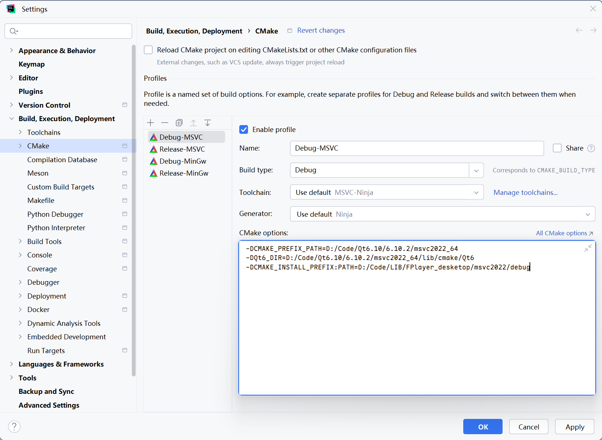
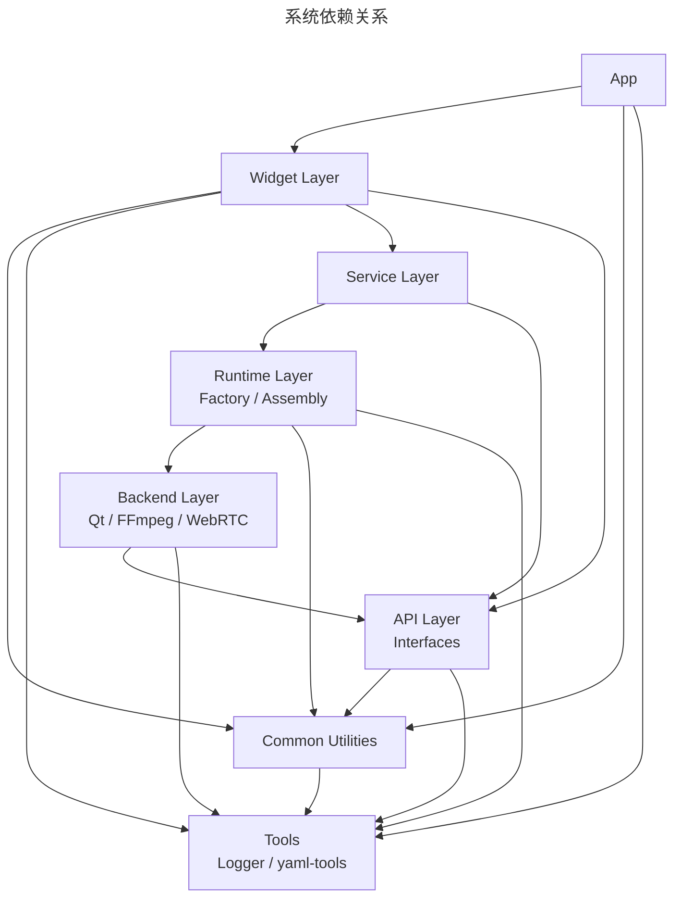

<p align="center">
  
</p>

<p align="center">
  
</p>

```
                            ███████╗██████╗ ██╗      █████╗ ██╗   ██╗███████╗██████╗
                            ██╔════╝██╔══██╗██║     ██╔══██╗╚██╗ ██╔╝██╔════╝██╔══██╗
                            █████╗  ██████╔╝██║     ███████║ ╚████╔╝ █████╗  ██████╔╝
                            ██╔══╝  ██╔═══╝ ██║     ██╔══██║  ╚██╔╝  ██╔══╝  ██╔══██╗
                            ██║     ██║     ███████╗██║  ██║   ██║   ███████╗██║  ██║
                            ╚═╝     ╚═╝     ╚══════╝╚═╝  ╚═╝   ╚═╝   ╚══════╝╚═╝  ╚═╝
````


# 产品

## 基本介绍

**跨平台多输入源的流媒体播放系统**

1. 桌面端，支持播放本地视频、捕获摄像头画面(包括虚拟摄像头)、屏幕共享，局域网环境下进行推流与拉流；推流侧支持 **组合模式**（多源画布布局、底部播放键随当前选中素材切换状态、后台 YUV 合成编码、组合链路音视频解耦；拉流采用监视窗口 + 独立预览窗口联动，详见 `doc/推拉流-使用说明.md` / `doc/推拉流-开发文档.md`）。
2. 安卓端，仅播放功能，但是局域网内可以实现拉流。

> 服务端模式提示：desktop 的"服务地址"请使用 `fplayer-ff-service` 运行后 `run/runtime.json` 中的 `gateway.url`，不要写死 `:9000`。

> 文档导航：`doc/README.md`

## 核心功能

### 本项目可独立提供的能力

- **双运行模式（重点）**：desktop 既可**单独使用（P2P/直连模式）**完成局域网点对点推拉流，也可接入 service 进入"服务端编排模式"扩展能力。
- **多输入源采集与播放**：支持本地视频、摄像头（含虚拟摄像头）、屏幕共享等输入源接入与预览。
- **推流与拉流一体化**：支持局域网内推流和拉流，拉流侧提供监视窗口 + 独立预览窗口联动。
- **组合模式推流**：多源画布布局（摄像头/屏幕/文件自由组合），素材拖拽缩放、可见性控制、设备冲突自动检测与恢复，后台 YUV 合成编码，组合链路音视频解耦。
- **AI 图池分析**：截图图池浏览、排序、大图预览，支持接入 OpenAI 兼容的多模态视觉模型进行图片 AI 识别分析，SSE 流式逐字输出。
- **拉流录制**：拉流过程中可随时开始/停止录制，支持独立录制链路，录制时长实时显示。
- **主题与个性化**：深色/浅色主题、自定义主题色、AI 聊天气泡颜色、字体字号等全面可配。
- **跨平台工程体系**：基于 Qt + CMake 组织多模块，可使用 MSVC/MinGW 工具链并打包为 Windows 安装包。

### 与其他项目的联合功能

- **与 `fplayer-ff-service` 联动（扩展模式）**：在保留 desktop 单机 P2P 能力的前提下，接入 service Gateway 以获得流地址解析、端口编排、统一分发与运维友好的增强能力。
- **与 `fplayer-ff-mobile` 联动（协同播放）**：desktop 作为内容生产端推流，mobile 作为移动播放端按同一 `app/stream` 拉流，实现跨设备实时观看。
- **三端协同链路**：desktop 采集并推流 -> service 中枢调度与发布 -> mobile/desktop 消费播放，形成完整的生产、调度、消费闭环。


# 技术

## 技术栈

桌面端为跨平台局域网流媒体应用：**C++17** 主体，**Qt 6** 负责 UI 与系统集成，**FFmpeg** 承担采集侧编码、推拉流与解码路径，**WebRTC** 提供低延迟实时链路能力；工程由 **CMake** 组织多模块（app / widget / service / runtime / backend / api 等），可选 MSVC 或 MinGW 工具链与 **CPack**（NSIS / WiX）产出 Windows 安装包。

- C++17
- Qt 6.10.2
- FFmpeg（推拉流、编解码）
- WebRTC（低延迟链路能力）
- CMake（工程组织与构建）

## 编译环境要求（Windows）

建议使用 Windows 10/11 x64，并准备以下环境：

- Visual Studio 2022（含 MSVC v143、Windows 10/11 SDK）
- CMake 3.24+
- Qt 6.10.2（与当前工程配置保持一致）
- Git 2.40+

可选工具（按需）：

- MinGW 64（如果你使用 MinGW 工具链编译）
- Ninja（若使用 `-G Ninja` 构建）

快速自检命令：

```powershell
cmake --version
git --version
```

Qt / 编译器建议通过 IDE 或环境变量确认：

- `qmake -v`（如果已配置到 PATH）
- 或在 CMake 配置中显式指定 `Qt6_DIR` / `CMAKE_PREFIX_PATH`

## CMake 配置示例

```cmake
# MSVC 2022
-DCMAKE_PREFIX_PATH=D:/Code/Qt6.10/6.10.2/msvc2022_64
-DQt6_DIR=D:/Code/Qt6.10/6.10.2/msvc2022_64/lib/cmake/Qt6
-DFPLAYER_BUILD_MEDIA_FFMPEG:BOOL=ON
-DFPLAYER_BUILD_STREAM_FFMPEG:BOOL=ON

# MinGW 64
-DCMAKE_PREFIX_PATH=D:/Code/Qt6.10/6.10.2/mingw_64
-DQt6_DIR=D:/Code/Qt6.10/6.10.2/mingw_64/lib/cmake/Qt6
-DFPLAYER_BUILD_MEDIA_FFMPEG:BOOL=ON
-DFPLAYER_BUILD_STREAM_FFMPEG:BOOL=ON
```

## CMake 构建选项

| 选项 | 默认值 | 说明 |
|------|--------|------|
| `FPLAYER_BUILD_MEDIA_QT6` | ON | Qt6 多媒体后端（播放） |
| `FPLAYER_BUILD_MEDIA_FFMPEG` | ON | FFmpeg 多媒体后端（播放） |
| `FPLAYER_BUILD_MEDIA_DXGI` | ON | DXGI 桌面采集（仅 Windows） |
| `FPLAYER_BUILD_STREAM_FFMPEG` | ON | FFmpeg 推拉流后端 |
| `FPLAYER_BUILD_NET_QT6` | OFF | Qt6 网络后端（空桩，未实现） |
| `FPLAYER_BUILD_RTC_WEBRTC` | OFF | WebRTC 后端 |

构建约定：

- Debug 构建产物带 `d` 后缀（`CMAKE_DEBUG_POSTFIX d`）
- 所有产物输出到 `${CMAKE_BINARY_DIR}/bin`

## 版本号管理

版本号以仓库根目录的 **`version.txt`** 为**唯一来源**，CMake / C++ 代码 / 打包脚本均从此读取：

```
version.txt  ──→  CMakeLists.txt 读取并设置 FPLAYER_PACKAGE_VERSION
                  ├──→  configure_file() 生成 version.h（C++ 中使用）
                  └──→  CPack 打包时用作安装包版本号
```

**日常开发**：直接编辑 `version.txt`，重新构建即可（CMake 自动检测文件变更并 re-configure，仅重编译 `capturewindow.cpp`，不会全量重编译）。

**打包时覆盖版本号**（不修改文件）：

```powershell
.\scripts\package-windows.ps1 -Version "1.0.1-rc1" -Qt6Dir "..." -CMakePrefixPath "..."
```

`-Version` 未指定时，打包脚本自动从 `version.txt` 读取。

> 详细说明见 `doc/弹窗滚动条与版本号统一管理.md`

## Windows 安装包打包

项目支持在 Windows 下通过 CPack 生成安装包：

- `.exe`（NSIS）
- `.msi`（WiX）

推荐使用一键脚本（项目根目录执行）：

```powershell
.\scripts\package-windows.ps1 -Qt6Dir "D:/Code/Qt6.10/6.10.2/msvc2022_64/lib/cmake/Qt6" -CMakePrefixPath "D:/Code/Qt6.10/6.10.2/msvc2022_64"
```

默认会将安装包统一复制到 `disk/windows`。

快速参考（也可用 `scripts/powershell脚本启动参数-new.txt` 中的参数）：

```powershell
.\scripts\package-windows.ps1 -Qt6Dir "D:/Code/Qt6.10/6.10.2/msvc2022_64/lib/cmake/Qt6" -CMakePrefixPath "D:/Code/Qt6.10/6.10.2/msvc2022_64" -Version 1.0.3
```

打包前需安装：

```powershell
choco install nsis -y          # NSIS 安装包制作工具
choco install imagemagick -y   # 图标格式转换
```

详细说明见 `doc/Windows-打包说明.md` 和 `doc/release-packaging.md`。

## 技术选型

>
> https://chatgpt.com/g/g-p-6971d5acf0c88191928b4001b06a20ae/c/69a55146-ec0c-83a8-9cb0-c43f0ccfbd91
> https://chatgpt.com/share/69a554d8-d534-8007-afc1-30ee6c803f77

两个方向：

1. GStreamer全家桶(流媒体处理流水线框架 -> 可以用它构建从采集、解码、处理、编码、封装、传输到播放的完整音视频系统)【适用于更强大的应用场景，如浏览器观看/NAT穿透/抄超低延迟互动(本质还是使用了GStreamer中的WebRTC)】
2. Qt/ffmpeg 后端 + ffmpeg推拉流(RTSP/SRT/RTMP) 【适用于局域网推拉流】

> 目前使用2，后面遇到性能瓶颈，再按照方向1进行升级

## 依赖

| 依赖 | 版本 |
| ---- | ---- |
| C++ | 17 |
| Qt | 6.10.2 |
| FFmpeg | 8.1 / 8.0.1 |
| spdlog | 1.17.0（通过 Logger v1.1.7） |
| yaml-cpp | 0.9.0（通过 yaml-tool v1.1.4） |

<p align="center">
  
</p>


# 架构

## 架构说明

**App**

应用层

**Widget**

UI层，交互逻辑

**Service**

服务层，调用音视频、网络模块，实现一系列功能模块

**Runtime**

运行时调用层，工厂职责

**Backend**

后端层，音视频、网络核心功能的封装与实现

**Api**

抽象层，统一后端层的接口，作为Runtime工厂的返回类型

**Common**

公共方法层，提供一些各层都可能用到的通用工具方法

**tools**

第三方的工具，例如logger等。没有作为一个单独的模块进行放置，作为cmake中的一个target进行了引入。

```
app
  ↓
widget
  ↓
service
  ↓
runtime
  ↓               |---- qt
backend ------|----| ffmpeg
  ↓               |---- webrtc
 api
  ↓
common
```

### 依赖规则

- API层作为接口定义层，应该被所有需要使用这些接口的层依赖：

  1. app层 ✅ -（依赖widget，间接依赖api）， 解析命令行参数时使用枚举类型
  2. widget层 ✅ - 使用接口类型（如 MediaBackendType 、 IFVideoView ）
  3. service层 ✅ - 使用接口定义和类型
  4. runtime层 ✅ - （依赖backend，间接依赖api）
  5. backend层 ✅ - 实现接口时需要包含接口头文件

- 只有 runtime 认识所有 backend



```mermaid
---
title: 系统依赖关系
---
graph TD
    APP[App]
    WIDGET[Widget Layer]
    SERVICE[Service Layer]
    RUNTIME[Runtime Layer<br/>Factory / Assembly]
    BACKEND[Backend Layer<br/>Qt / FFmpeg / WebRTC]
    API[API Layer<br/>Interfaces]
    COMMON[Common Utilities]
    TOOLS[Tools<br/>Logger / yaml-tools]

    APP --> WIDGET
    APP --> COMMON
    APP --> TOOLS

    WIDGET --> COMMON
    WIDGET --> TOOLS
    WIDGET --> SERVICE
    WIDGET --> API

    SERVICE --> RUNTIME
    SERVICE --> API

    RUNTIME --> BACKEND
    RUNTIME --> COMMON
    RUNTIME --> TOOLS

    BACKEND --> API
    BACKEND --> TOOLS
    API --> COMMON
    API --> TOOLS

    COMMON --> TOOLS
```

## 图池（Image Pool）

独立窗体，以相册方式浏览截图目录下的所有图片。点击底部栏「图池」按钮或菜单栏「视图 → 图池」打开。

| 功能 | 操作 |
|------|------|
| 浏览截图 | 缩略图网格展示，保持原图比例，支持排序（日期/名称/大小） |
| 自动同步 | 截图后即时刷新；QFileSystemWatcher 监听目录变更；手动刷新按钮 |
| 大图预览 | 双击打开，支持键盘 ←→ 导航、+/- 缩放、0 还原 |
| 右键菜单 | 打开 / 所在文件夹 / 复制 / 复制路径 / 重命名 / 删除 |
| AI 识别 | 右键 → AI 识别，打开对话窗（自动发送分析请求），SSE 流式逐字输出 + 闪烁光标 |
| 配色自定义 | 系统设置中可调整用户气泡、AI 气泡、聊天背景、工具栏颜色（色块+取色器） |
| 拉流预览图池 | 拉流预览窗口也有图池按钮，与主窗口共享同一图池实例 |

### AI 识别配置

在「系统设置 → AI 识别配置」中填写：

| 字段 | 说明 |
|------|------|
| API 地址 | OpenAI 兼容的 Chat Completions 端点 |
| API Key | 服务商颁发的密钥（密码框，保存后回显隐藏） |
| 模型 | **多模态视觉模型**（必须支持图片识别，纯文本模型会报 400 错误） |

> **关键**：模型必须支持图片输入（vision/multimodal）。DeepSeek V3/R1 等纯文本模型无法使用。
> 推荐入门：智谱 `glm-4v-flash`（免费额度）或通义千问 `qwen-vl-plus`（国内直连）。
> 打开 AI 对话窗后自动发送"请分析一下图片内容"，后续问题可手动输入。
> 详细配置见 `doc/图池与AI分析集成-调研文档.md`。

## 设置页面

点击底部栏「设置」按钮，可配置：截图/录制目录、屏幕采集后端、文件播放后端、关闭行为、组合模式拖拽虚框、AI 识别参数、聊天外观、字体、主题（深色/浅色）、主题色等。

## 性能特性

- **编码器低延迟调优**：NVENC（p1 + ll + cbr + zerolatency + rc-lookahead=0）、AMF（ultralowlatency + speed + cbr）、x264（ultrafast + zerolatency），端到端延迟降低 30-50%
- **屏幕采集双路缩放合并**：预览+推流两次 `sws_scale` 合并为一次，4K 下 CPU 占用降低 30-40%
- **OpenGL 渲染管线优化**：双缓冲 PBO 异步纹理上传、shader 位置缓存，渲染帧率提升 15-25%
- **帧数据零拷贝传输**：利用 Qt COW 隐式共享消除 YUV 帧传递中的深拷贝，每帧节省约 36MB 内存带宽
- **摄像头枚举缓存**：30 秒 TTL 缓存，模式切换加速 1-5 秒
- **启动画面**：紫色磨砂启动动画，窗口秒开
- 详见 `doc/性能优化清单.md`、`doc/马尾辫优化清单.md`

## 相关链接

| 链接 | 说明 |
|------|------|
| [官网](https://codis.fun/fplayer) | 项目官网 |
| [GitHub](https://github.com/ff-283) | 项目主页与源码 |
| `doc/README.md` | 文档导航（用户手册/开发文档/打包说明等） |
| `doc/man/用户手册.md` | 功能总览与快速上手 |
| `doc/推拉流-使用说明.md` | 推流/拉流操作指南 |
| `doc/推拉流-开发文档.md` | 推拉流实现细节与链路设计 |
| `doc/连接模式与服务分发说明.md` | 直连模式 vs 服务分发模式 |
| `doc/性能优化清单.md` | 系统性能优化分析与方案 |
| `doc/马尾辫优化清单.md` | 代码质量优化记录 |
| `doc/Windows-打包说明.md` | Windows 安装包生成方式 |
| `doc/release-packaging.md` | 发包规范与发布流程 |
| `doc/弹窗滚动条与版本号统一管理.md` | 版本号管理机制详解 |
| `doc/图池与AI分析集成-调研文档.md` | AI 图池分析配置说明 |
| `doc/Linux适配方案.md` | Linux 平台适配项清单 |
| `doc/屏幕捕获模式-设计与拆分说明.md` | 屏幕采集链路设计 |
| `doc/windows-audio-backend-开发说明.md` | Windows 音频后端实现 |
| `doc/problems/` | 各类问题记录与排障笔记 |
