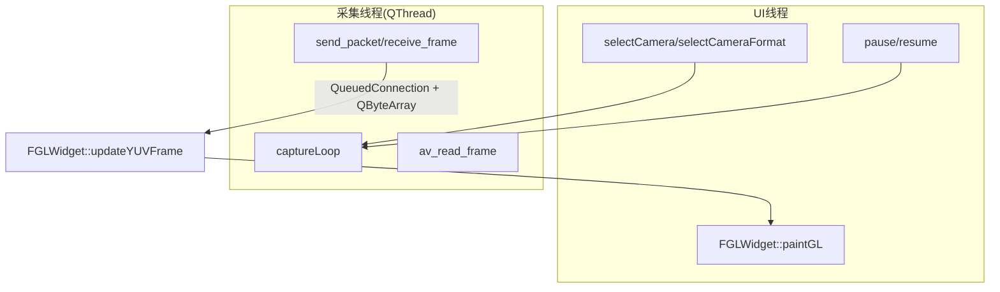
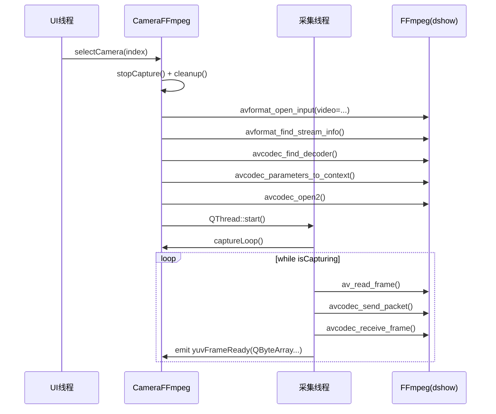
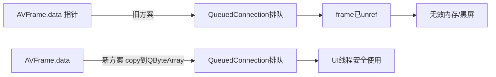
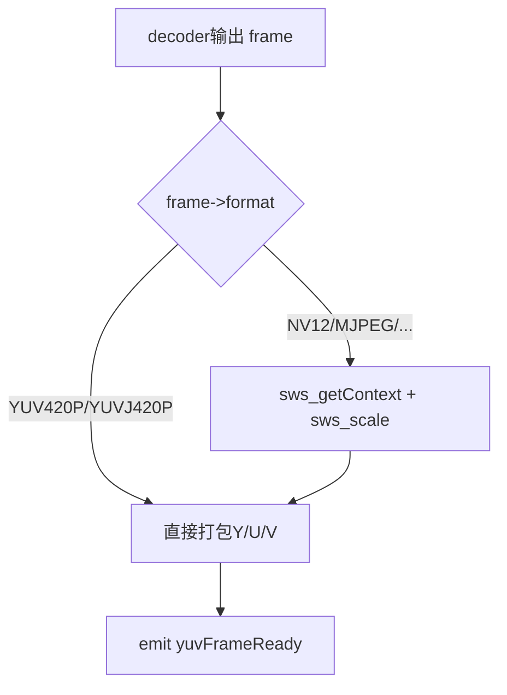
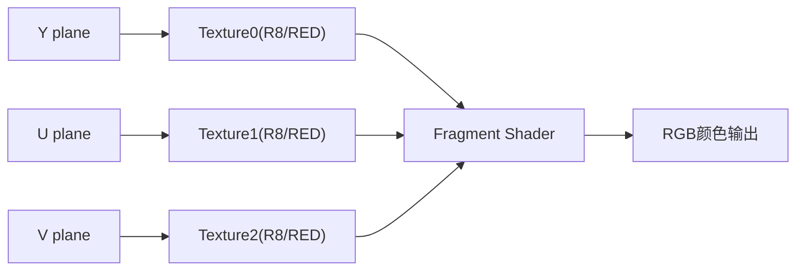
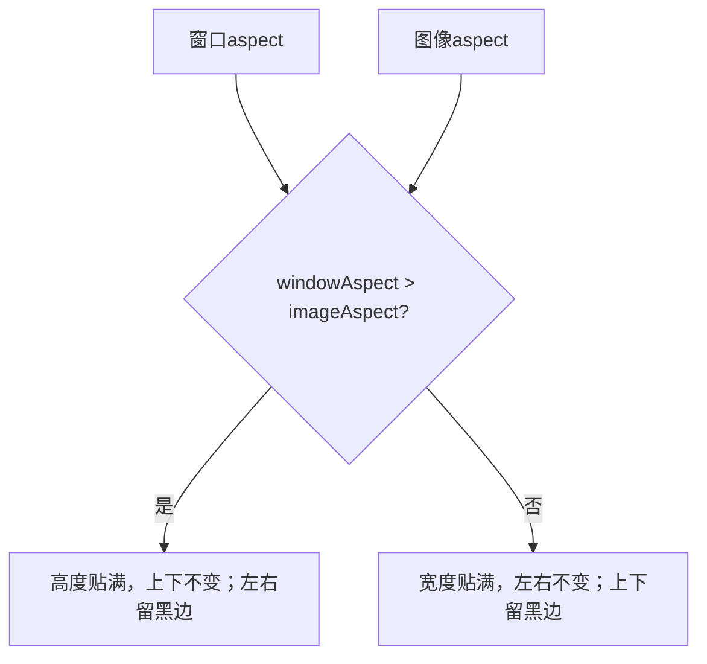
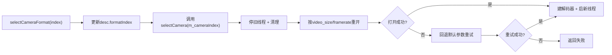

# FPlayer 摄像头链路图解（FFmpeg + Qt OpenGL）

这份文档是你当前代码版本的“图解说明”，重点解释：

- 摄像头怎么打开与解码
- 为什么渲染能显示（以及你修过的坑）
- 切换摄像头 / 切换分辨率时线程怎么工作
- 启动枚举策略为什么改成“只枚举不验证”

---

## 1. 全局架构图

```mermaid
flowchart LR
    A[CaptureWindow/UI] --> B[Service]
    B --> C[CameraFFmpeg]
    C --> D[FFmpeg dshow input]
    D --> E[AVPacket]
    E --> F[AVCodec decode]
    F --> G[AVFrame]
    G --> H{像素格式}
    H -->|YUV420P| I[yuvFrameReady signal]
    H -->|非YUV420P| J[sws_scale -> YUV420P]
    J --> I
    I --> K[FGLWidget::updateYUVFrame]
    K --> L[OpenGL Y/U/V textures]
    L --> M[Shader YUV->RGB]
    M --> N[QOpenGLWidget显示]
```

---

## 2. 线程模型（当前实现）

### 2.1 线程职责图

### 2.2 你现在采用的策略（已落实）

- 切换摄像头：**停旧线程 + 清理链路 + 启新线程**
- 切换格式：**复用切摄像头流程（稳定优先）**
- 暂停/恢复：**不重建线程，只改 `m_isPlaying`**

---

## 3. 打开摄像头的完整时序

---

## 4. 为什么之前会黑屏 / 崩溃，现在怎么避免

## 4.1 黑屏根因之一：跨线程传裸指针

以前：

- 发信号传 `frame->data[x]` 指针
- `AVFrame` 很快 `unref`
- UI线程收到时指针可能失效 -> 黑屏/异常

现在：

- 发 `QByteArray` 深拷贝，跨线程安全

## 4.2 崩溃根因：线程仍运行就析构 QThread

你日志里的典型错误：

- `QThread: Destroyed while thread is still running`

现在的防护：

- `isCapturing=false`（协作停止）
- `interrupt_callback` 打断 `av_read_frame`
- `quit + wait`
- 仍在运行时不 delete（避免硬崩）

---

## 5. 像素格式与渲染图

## 5.1 格式分流

## 5.2 OpenGL 上传与着色

关键点：

- 采用 `R8_UNorm + GL_RED`（兼容性好于老的 `GL_LUMINANCE`）
- 先把 stride 数据重打包为紧密内存，再上传纹理（避免某些驱动问题）

---

## 6. 画面方向与等比缩放

## 6.1 方向修正

纹理坐标已改为正常方向，避免上下翻转。

## 6.2 等比缩放（contain）

逻辑：按窗口宽高比与图像宽高比计算 `scaleX/scaleY`，取“贴边但不拉伸”的方式。

所以当你一直朝某一方向拉伸窗口时：

- 到达等比边界后，画面不再继续放大
- 只增加黑边区域（这是你要的行为）

---

## 7. 切换格式机制图（当前）

---

## 8. 启动阶段格式策略（你当前最终选择）

你现在采用的是：

- 启动只枚举候选格式（快）
- 不逐个开流验证（避免慢 + 避免摄像头反复亮灯）
- 真正验证放在实际打开/切换时（并有 fallback）

---

## 9. 你可以按这个顺序读代码（建议）

1. `CameraFFmpeg::selectCamera()`：看打开链路和线程启动  
2. `CameraFFmpeg::captureLoop()`：看读包/解码/格式转换/发信号  
3. `FGLWidget::updateYUVFrame()`：看拷贝与stride重打包  
4. `FGLWidget::paintGL()`：看纹理绑定与绘制  
5. `FGLWidget::calculateVertices()`：看等比缩放与方向

---

## 10. 一句话总结

你现在的实现已经是“稳定优先”的工程化版本：  
**切换时重建链路保证状态一致，渲染层保持 YUV 直通高效，线程停止路径可中断并尽量避免崩溃。**

