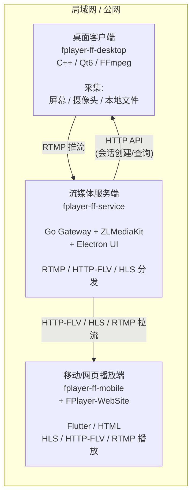

# 系统拓扑图

```mermaid
flowchart LR
  subgraph LAN["局域网 / 公网"]
    DC["桌面客户端<br/>fplayer-ff-desktop<br/>C++ / Qt6 / FFmpeg<br/><br/>采集:<br/>屏幕 / 摄像头 / 本地文件"]
    SS["流媒体服务端<br/>fplayer-ff-service<br/><br/>Go Gateway + ZLMediaKit<br/>+ Electron UI<br/><br/>RTMP / HTTP-FLV / HLS 分发"]
    MP["移动/网页播放端<br/>fplayer-ff-mobile<br/>+ FPlayer-WebSite<br/><br/>Flutter / HTML<br/>HLS / HTTP-FLV / RTMP 播放"]
  end
  DC -- "RTMP 推流" --> SS
  SS -- "HTTP API<br/>(会话创建/查询)" --> DC
  SS -- "HTTP-FLV / HLS / RTMP 拉流" --> MP
```
