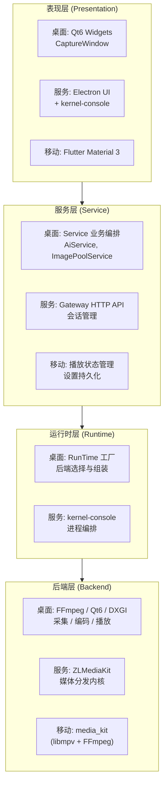

# 分层架构图

```mermaid
flowchart TB
  subgraph P["表现层 (Presentation)"]
    direction LR
    P1["桌面: Qt6 Widgets<br/>CaptureWindow"]
    P2["服务: Electron UI<br/>+ kernel-console"]
    P3["移动: Flutter Material 3"]
  end
  subgraph S["服务层 (Service)"]
    direction LR
    S1["桌面: Service 业务编排<br/>AiService, ImagePoolService"]
    S2["服务: Gateway HTTP API<br/>会话管理"]
    S3["移动: 播放状态管理<br/>设置持久化"]
  end
  subgraph R["运行时层 (Runtime)"]
    direction LR
    R1["桌面: RunTime 工厂<br/>后端选择与组装"]
    R2["服务: kernel-console<br/>进程编排"]
  end
  subgraph B["后端层 (Backend)"]
    direction LR
    B1["桌面: FFmpeg / Qt6 / DXGI<br/>采集 / 编码 / 播放"]
    B2["服务: ZLMediaKit<br/>媒体分发内核"]
    B3["移动: media_kit<br/>(libmpv + FFmpeg)"]
  end
  P --> S --> R --> B
```
