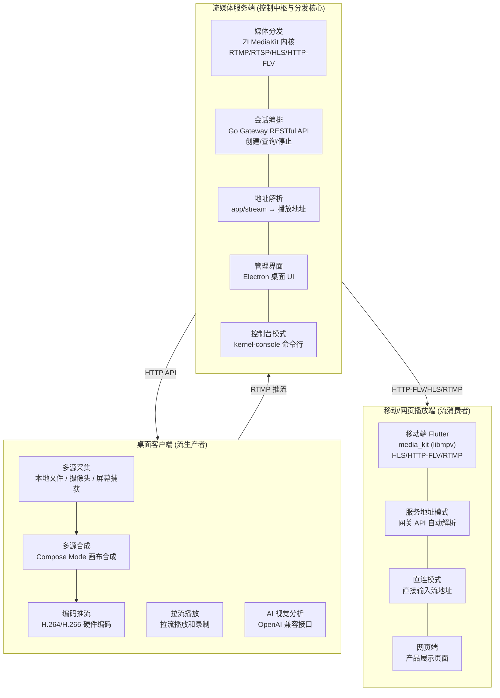

# 三端职责划分图

```mermaid
flowchart TB
  subgraph DC["桌面客户端 (流生产者)"]
    direction TB
    DC1["多源采集<br/>本地文件 / 摄像头 / 屏幕捕获"]
    DC2["多源合成<br/>Compose Mode 画布合成"]
    DC3["编码推流<br/>H.264/H.265 硬件编码"]
    DC4["拉流播放<br/>拉流播放和录制"]
    DC5["AI 视觉分析<br/>OpenAI 兼容接口"]
    DC1 --> DC2 --> DC3
    DC4
    DC5
  end
  subgraph SS["流媒体服务端 (控制中枢与分发核心)"]
    direction TB
    SS1["媒体分发<br/>ZLMediaKit 内核<br/>RTMP/RTSP/HLS/HTTP-FLV"]
    SS2["会话编排<br/>Go Gateway RESTful API<br/>创建/查询/停止"]
    SS3["地址解析<br/>app/stream → 播放地址"]
    SS4["管理界面<br/>Electron 桌面 UI"]
    SS5["控制台模式<br/>kernel-console 命令行"]
    SS1 --- SS2 --- SS3 --- SS4 --- SS5
  end
  subgraph MP["移动/网页播放端 (流消费者)"]
    direction TB
    MP1["移动端 Flutter<br/>media_kit (libmpv)<br/>HLS/HTTP-FLV/RTMP"]
    MP2["服务地址模式<br/>网关 API 自动解析"]
    MP3["直连模式<br/>直接输入流地址"]
    MP4["网页端<br/>产品展示页面"]
    MP1 --- MP2 --- MP3 --- MP4
  end
  DC -- "RTMP 推流" --> SS
  SS -- "HTTP API" --> DC
  SS -- "HTTP-FLV/HLS/RTMP" --> MP
```
