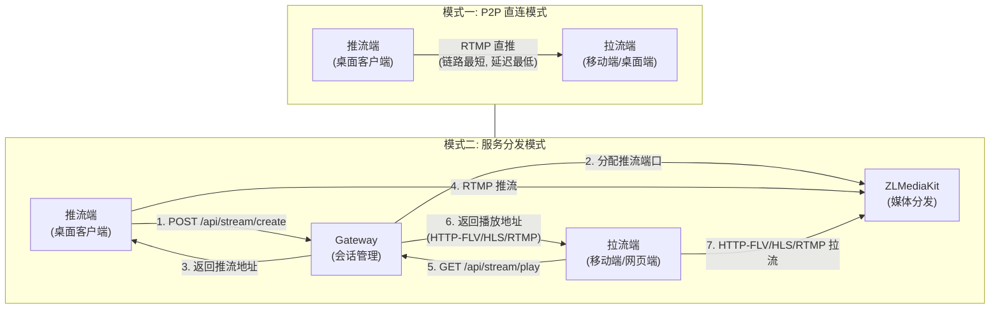

# 工作模式对比图

```mermaid
flowchart TB
  subgraph P2P["模式一: P2P 直连模式"]
    direction LR
    P1["推流端<br/>(桌面客户端)"] -- "RTMP 直推<br/>(链路最短, 延迟最低)" --> P2["拉流端<br/>(移动端/桌面端)"]
  end
  subgraph SRV["模式二: 服务分发模式"]
    direction LR
    S1["推流端<br/>(桌面客户端)"]
    S2["Gateway<br/>(会话管理)"]
    S3["ZLMediaKit<br/>(媒体分发)"]
    S4["拉流端<br/>(移动端/网页端)"]
    S1 -- "1. POST /api/stream/create" --> S2
    S2 -- "2. 分配推流端口" --> S3
    S2 -- "3. 返回推流地址" --> S1
    S1 -- "4. RTMP 推流" --> S3
    S4 -- "5. GET /api/stream/play" --> S2
    S2 -- "6. 返回播放地址<br/>(HTTP-FLV/HLS/RTMP)" --> S4
    S4 -- "7. HTTP-FLV/HLS/RTMP 拉流" --> S3
  end
  P2P --- SRV
```
