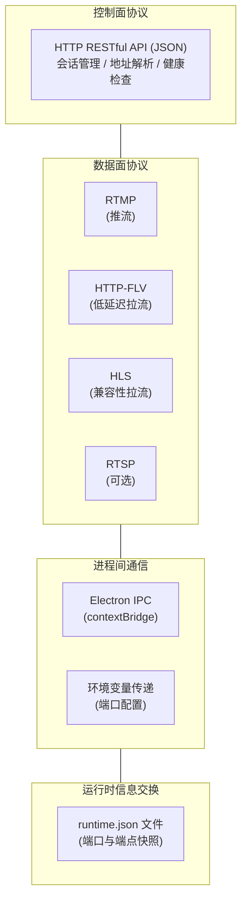

# 通信协议体系图

```mermaid
flowchart TB
  subgraph CP["控制面协议"]
    CP1["HTTP RESTful API (JSON)<br/>会话管理 / 地址解析 / 健康检查"]
  end
  subgraph DP["数据面协议"]
    direction LR
    DP1["RTMP<br/>(推流)"]
    DP2["HTTP-FLV<br/>(低延迟拉流)"]
    DP3["HLS<br/>(兼容性拉流)"]
    DP4["RTSP<br/>(可选)"]
  end
  subgraph IPC["进程间通信"]
    direction LR
    IPC1["Electron IPC<br/>(contextBridge)"]
    IPC2["环境变量传递<br/>(端口配置)"]
  end
  subgraph RT["运行时信息交换"]
    RT1["runtime.json 文件<br/>(端口与端点快照)"]
  end
  CP --- DP --- IPC --- RT
```
