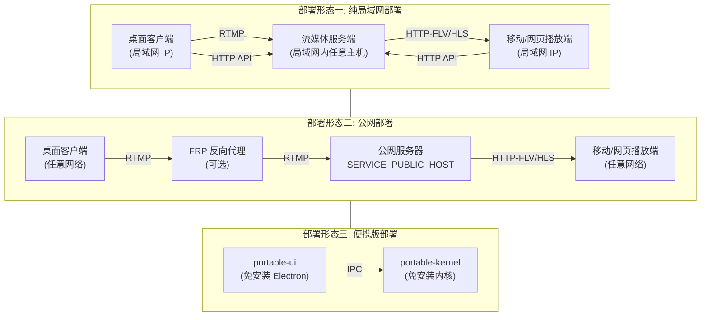

# 部署架构图

```mermaid
flowchart TB
  subgraph D1["部署形态一: 纯局域网部署"]
    direction LR
    D1A["桌面客户端<br/>(局域网 IP)"]
    D1B["流媒体服务端<br/>(局域网内任意主机)"]
    D1C["移动/网页播放端<br/>(局域网 IP)"]
    D1A -- "RTMP" --> D1B
    D1B -- "HTTP-FLV/HLS" --> D1C
    D1A -- "HTTP API" --> D1B
    D1C -- "HTTP API" --> D1B
  end
  subgraph D2["部署形态二: 公网部署"]
    direction LR
    D2A["桌面客户端<br/>(任意网络)"]
    D2B["公网服务器<br/>SERVICE_PUBLIC_HOST"]
    D2C["FRP 反向代理<br/>(可选)"]
    D2D["移动/网页播放端<br/>(任意网络)"]
    D2A -- "RTMP" --> D2C
    D2C -- "RTMP" --> D2B
    D2B -- "HTTP-FLV/HLS" --> D2D
  end
  subgraph D3["部署形态三: 便携版部署"]
    direction LR
    D3A["portable-ui<br/>(免安装 Electron)"]
    D3B["portable-kernel<br/>(免安装内核)"]
    D3A -- "IPC" --> D3B
  end
  D1 --- D2 --- D3
```
