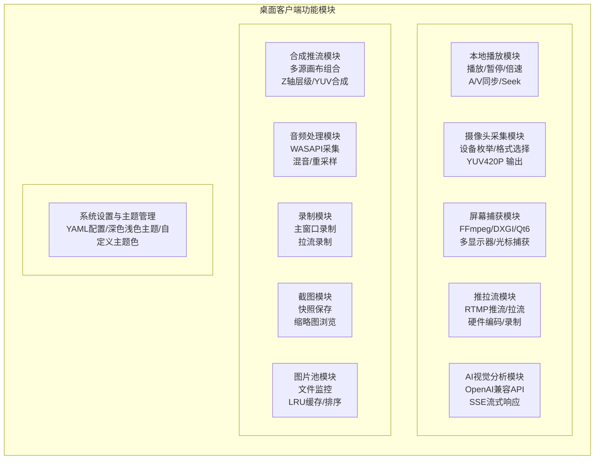

# 桌面客户端功能模块总览图

```mermaid
flowchart TB
  subgraph MOD["桌面客户端功能模块"]
    direction TB
    subgraph ROW1[" "]
      direction LR
      M1["本地播放模块<br/>播放/暂停/倍速<br/>A/V同步/Seek"]
      M2["摄像头采集模块<br/>设备枚举/格式选择<br/>YUV420P 输出"]
      M3["屏幕捕获模块<br/>FFmpeg/DXGI/Qt6<br/>多显示器/光标捕获"]
      M4["推拉流模块<br/>RTMP推流/拉流<br/>硬件编码/录制"]
      M5["AI视觉分析模块<br/>OpenAI兼容API<br/>SSE流式响应"]
    end
    subgraph ROW2[" "]
      direction LR
      M6["合成推流模块<br/>多源画布组合<br/>Z轴层级/YUV合成"]
      M7["音频处理模块<br/>WASAPI采集<br/>混音/重采样"]
      M8["录制模块<br/>主窗口录制<br/>拉流录制"]
      M9["截图模块<br/>快照保存<br/>缩略图浏览"]
      M10["图片池模块<br/>文件监控<br/>LRU缓存/排序"]
    end
    subgraph ROW3[" "]
      M11["系统设置与主题管理<br/>YAML配置/深色浅色主题/自定义主题色"]
    end
  end
```
