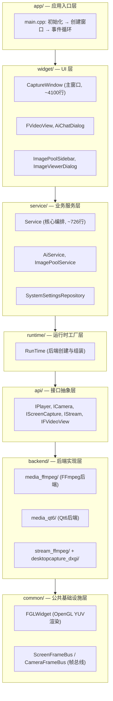

# 桌面客户端分层架构图

```mermaid
flowchart TB
  subgraph APP["app/ — 应用入口层"]
    A1["main.cpp: 初始化 → 创建窗口 → 事件循环"]
  end
  subgraph WIDGET["widget/ — UI 层"]
    W1["CaptureWindow (主窗口, ~4100行)"]
    W2["FVideoView, AiChatDialog"]
    W3["ImagePoolSidebar, ImageViewerDialog"]
  end
  subgraph SERVICE["service/ — 业务服务层"]
    S1["Service (核心编排, ~726行)"]
    S2["AiService, ImagePoolService"]
    S3["SystemSettingsRepository"]
  end
  subgraph RUNTIME["runtime/ — 运行时工厂层"]
    R1["RunTime (后端创建与组装)"]
  end
  subgraph API["api/ — 接口抽象层"]
    AP1["IPlayer, ICamera, IScreenCapture, IStream, IFVideoView"]
  end
  subgraph BACKEND["backend/ — 后端实现层"]
    B1["media_ffmpeg/ (FFmpeg后端)"]
    B2["media_qt6/ (Qt6后端)"]
    B3["stream_ffmpeg/ + desktopcapture_dxgi/"]
  end
  subgraph COMMON["common/ — 公共基础设施层"]
    C1["FGLWidget (OpenGL YUV渲染)"]
    C2["ScreenFrameBus / CameraFrameBus (帧总线)"]
  end
  APP --> WIDGET --> SERVICE --> RUNTIME
  RUNTIME --> API
  API --> BACKEND
  BACKEND --> COMMON
```
