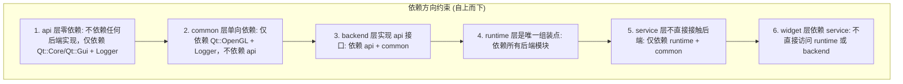

# 模块依赖规则图

```mermaid
flowchart TB
  subgraph RULES["依赖方向约束 (自上而下)"]
    R1["1. api 层零依赖: 不依赖任何后端实现，仅依赖 Qt::Core/Qt::Gui + Logger"]
    R2["2. common 层单向依赖: 仅依赖 Qt::OpenGL + Logger，不依赖 api"]
    R3["3. backend 层实现 api 接口: 依赖 api + common"]
    R4["4. runtime 层是唯一组装点: 依赖所有后端模块"]
    R5["5. service 层不直接接触后端: 仅依赖 runtime + common"]
    R6["6. widget 层依赖 service: 不直接访问 runtime 或 backend"]
  end
  R1 --> R2 --> R3 --> R4 --> R5 --> R6
```
