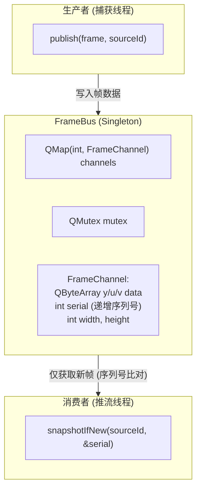

# 帧总线生产者消费者模式图

```mermaid
flowchart TB
  subgraph PROD["生产者 (捕获线程)"]
    P1["publish(frame, sourceId)"]
  end
  subgraph BUS["FrameBus (Singleton)"]
    B1["QMap(int, FrameChannel) channels"]
    B2["QMutex mutex"]
    B3["FrameChannel:<br/>QByteArray y/u/v data<br/>int serial (递增序列号)<br/>int width, height"]
  end
  subgraph CONS["消费者 (推流线程)"]
    C1["snapshotIfNew(sourceId, &serial)"]
  end
  PROD -- "写入帧数据" --> BUS
  BUS -- "仅获取新帧 (序列号比对)" --> CONS
```
