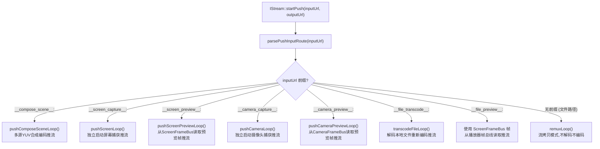

# 推流 URL Scheme 路由图

```mermaid
flowchart TB
  API["IStream::startPush(inputUrl, outputUrl)"] --> PARSE["parsePushInputRoute(inputUrl)"]
  PARSE --> R1{"inputUrl 前缀?"}
  R1 -- "__compose_scene__:" --> F1["pushComposeSceneLoop()<br/>多源YUV合成编码推流"]
  R1 -- "__screen_capture__:" --> F2["pushScreenLoop()<br/>独立启动屏幕捕获推流"]
  R1 -- "__screen_preview__:" --> F3["pushScreenPreviewLoop()<br/>从ScreenFrameBus读取预览帧推流"]
  R1 -- "__camera_capture__:" --> F4["pushCameraLoop()<br/>独立启动摄像头捕获推流"]
  R1 -- "__camera_preview__:" --> F5["pushCameraPreviewLoop()<br/>从CameraFrameBus读取预览帧推流"]
  R1 -- "__file_transcode__:" --> F6["transcodeFileLoop()<br/>解码本地文件重新编码推流"]
  R1 -- "__file_preview__:" --> F7["使用 ScreenFrameBus 帧<br/>从播放器帧总线读取推流"]
  R1 -- "无前缀 (文件路径)" --> F8["remuxLoop()<br/>流拷贝模式,不解码不编码"]
```
