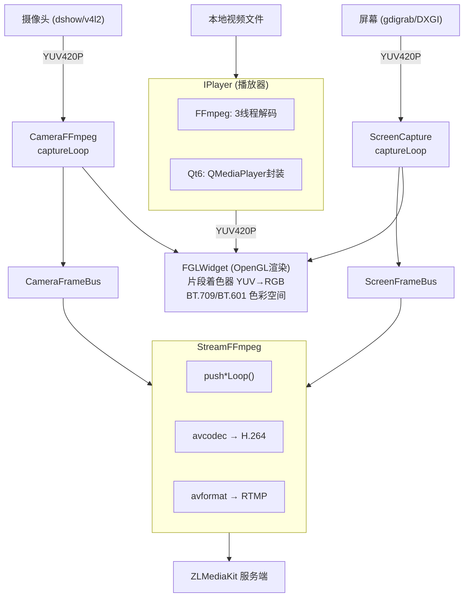

# 桌面客户端数据流全景图

```mermaid
flowchart TB
  FILE["本地视频文件"] --> PLAYER
  subgraph PLAYER["IPlayer (播放器)"]
    P1["FFmpeg: 3线程解码"]
    P2["Qt6: QMediaPlayer封装"]
  end
  PLAYER -- "YUV420P" --> FGL["FGLWidget (OpenGL渲染)<br/>片段着色器 YUV→RGB<br/>BT.709/BT.601 色彩空间"]
  CAM["摄像头 (dshow/v4l2)"] -- "YUV420P" --> CAMCAP["CameraFFmpeg<br/>captureLoop"]
  SCR["屏幕 (gdigrab/DXGI)"] -- "YUV420P" --> SCRCAP["ScreenCapture<br/>captureLoop"]
  CAMCAP --> CAMBUS["CameraFrameBus"]
  SCRCAP --> SCRBUS["ScreenFrameBus"]
  CAMCAP --> FGL
  SCRCAP --> FGL
  CAMBUS --> STREAM
  SCRBUS --> STREAM
  subgraph STREAM["StreamFFmpeg"]
    S1["push*Loop()"]
    S2["avcodec → H.264"]
    S3["avformat → RTMP"]
  end
  STREAM --> ZLM["ZLMediaKit 服务端"]
```
