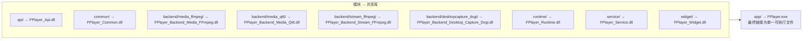

# CMake 模块化构建体系图

```mermaid
flowchart LR
  subgraph MODULES["模块 → 共享库"]
    M1["api/ → FPlayer_Api.dll"]
    M2["common/ → FPlayer_Common.dll"]
    M3["backend/media_ffmpeg/ → FPlayer_Backend_Media_FFmpeg.dll"]
    M4["backend/media_qt6/ → FPlayer_Backend_Media_Qt6.dll"]
    M5["backend/stream_ffmpeg/ → FPlayer_Backend_Stream_FFmpeg.dll"]
    M6["backend/desktopcapture_dxgi/ → FPlayer_Backend_Desktop_Capture_Dxgi.dll"]
    M7["runtime/ → FPlayer_Runtime.dll"]
    M8["service/ → FPlayer_Service.dll"]
    M9["widget/ → FPlayer_Widget.dll"]
  end
  MODULES --> EXE["app/ → FPlayer.exe<br/>最终链接为单一可执行文件"]
```
