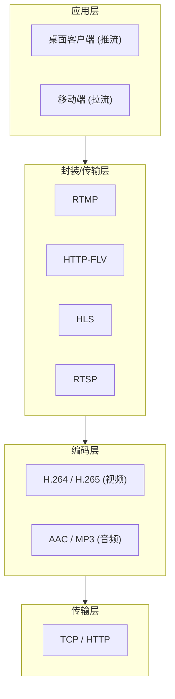

# 协议栈分层图

```mermaid
flowchart TB
  subgraph APP["应用层"]
    direction LR
    A1["桌面客户端 (推流)"]
    A2["移动端 (拉流)"]
  end
  subgraph ENC["封装/传输层"]
    direction LR
    E1["RTMP"]
    E2["HTTP-FLV"]
    E3["HLS"]
    E4["RTSP"]
  end
  subgraph COD["编码层"]
    direction LR
    C1["H.264 / H.265 (视频)"]
    C2["AAC / MP3 (音频)"]
  end
  subgraph TRA["传输层"]
    T1["TCP / HTTP"]
  end
  APP --> ENC --> COD --> TRA
```
