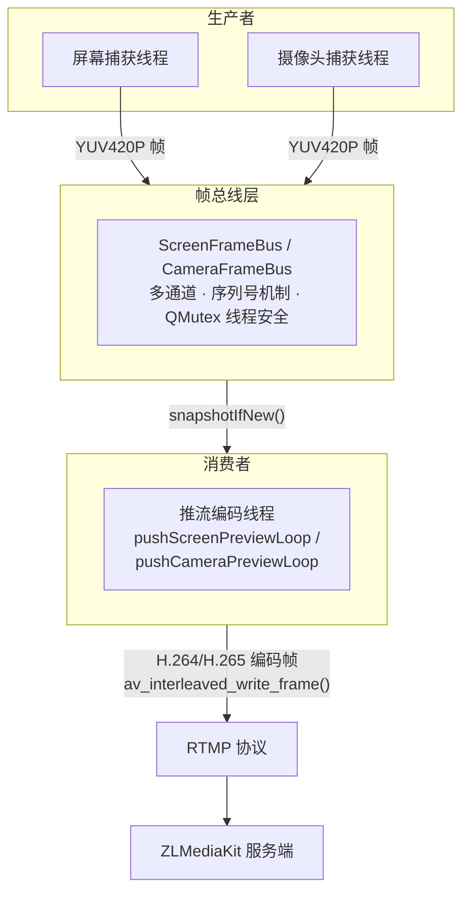

# 帧总线数据流路径图

```mermaid
flowchart TB
  subgraph PROD["生产者"]
    direction LR
    P1["屏幕捕获线程"]
    P2["摄像头捕获线程"]
  end
  P1 -- "YUV420P 帧" --> BUS
  P2 -- "YUV420P 帧" --> BUS
  subgraph BUS["帧总线层"]
    B1["ScreenFrameBus / CameraFrameBus<br/>多通道 · 序列号机制 · QMutex 线程安全"]
  end
  BUS -- "snapshotIfNew()" --> CONS
  subgraph CONS["消费者"]
    C1["推流编码线程<br/>pushScreenPreviewLoop /<br/>pushCameraPreviewLoop"]
  end
  CONS -- "H.264/H.265 编码帧<br/>av_interleaved_write_frame()" --> RTMP
  RTMP["RTMP 协议"]
  RTMP --> ZLM["ZLMediaKit 服务端"]
```
