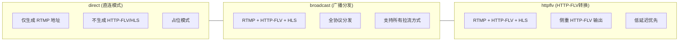

# 三种服务模式对比图

```mermaid
flowchart LR
  subgraph DIRECT["direct (直连模式)"]
    D1["仅生成 RTMP 地址"]
    D2["不生成 HTTP-FLV/HLS"]
    D3["占位模式"]
  end
  subgraph BROADCAST["broadcast (广播分发)"]
    B1["RTMP + HTTP-FLV + HLS"]
    B2["全协议分发"]
    B3["支持所有拉流方式"]
  end
  subgraph HTTPFLV["httpflv (HTTP-FLV转换)"]
    H1["RTMP + HTTP-FLV + HLS"]
    H2["侧重 HTTP-FLV 输出"]
    H3["低延迟优先"]
  end
  DIRECT --- BROADCAST --- HTTPFLV
```
