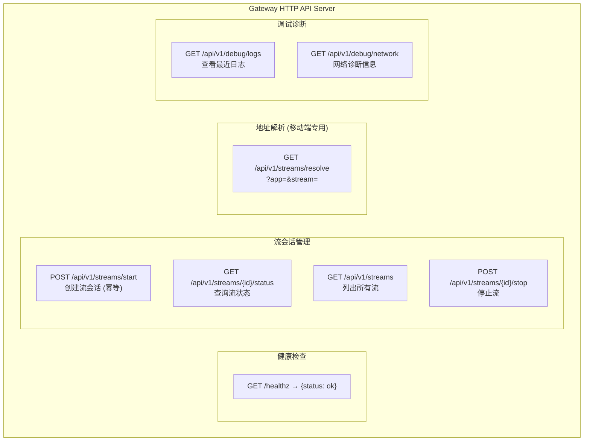

# Gateway API 端点体系图

```mermaid
flowchart TB
  subgraph GW["Gateway HTTP API Server"]
    subgraph HEALTH["健康检查"]
      H1["GET /healthz → {status: ok}"]
    end
    subgraph STREAM["流会话管理"]
      S1["POST /api/v1/streams/start<br/>创建流会话 (幂等)"]
      S2["GET /api/v1/streams/{id}/status<br/>查询流状态"]
      S3["GET /api/v1/streams<br/>列出所有流"]
      S4["POST /api/v1/streams/{id}/stop<br/>停止流"]
    end
    subgraph RESOLVE["地址解析 (移动端专用)"]
      R1["GET /api/v1/streams/resolve<br/>?app=&stream="]
    end
    subgraph DEBUG["调试诊断"]
      D1["GET /api/v1/debug/logs<br/>查看最近日志"]
      D2["GET /api/v1/debug/network<br/>网络诊断信息"]
    end
  end
```
