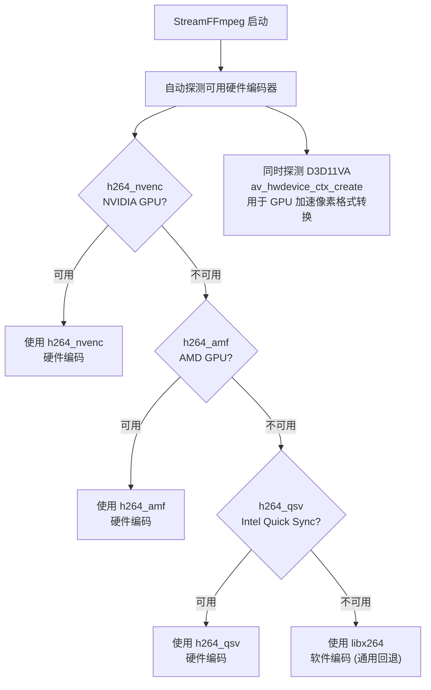

# 编码器选择策略图

```mermaid
flowchart TB
  START["StreamFFmpeg 启动"] --> DETECT["自动探测可用硬件编码器"]
  DETECT --> NV{"h264_nvenc<br/>NVIDIA GPU?"}
  NV -- "可用" --> NV_USE["使用 h264_nvenc<br/>硬件编码"]
  NV -- "不可用" --> AMD{"h264_amf<br/>AMD GPU?"}
  AMD -- "可用" --> AMD_USE["使用 h264_amf<br/>硬件编码"]
  AMD -- "不可用" --> QSV{"h264_qsv<br/>Intel Quick Sync?"}
  QSV -- "可用" --> QSV_USE["使用 h264_qsv<br/>硬件编码"]
  QSV -- "不可用" --> SW["使用 libx264<br/>软件编码 (通用回退)"]
  DETECT --> D3D["同时探测 D3D11VA<br/>av_hwdevice_ctx_create<br/>用于 GPU 加速像素格式转换"]
```
