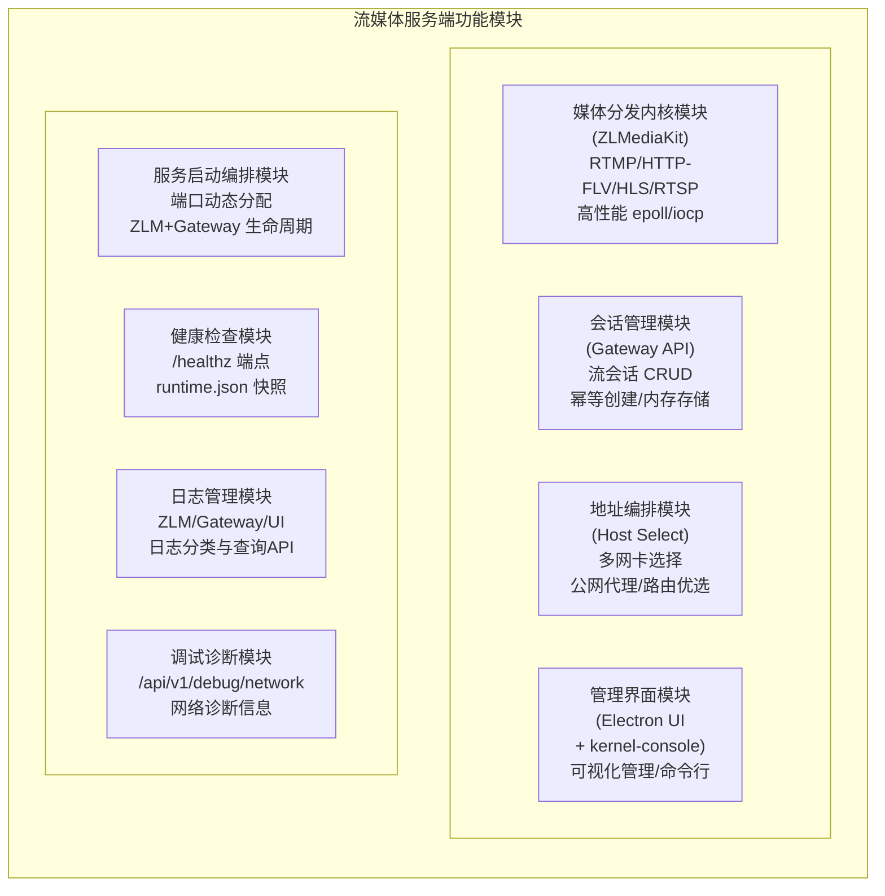

# 流媒体服务端功能模块总览图

```mermaid
flowchart TB
  subgraph MOD["流媒体服务端功能模块"]
    direction TB
    subgraph ROW1[" "]
      direction LR
      M1["媒体分发内核模块<br/>(ZLMediaKit)<br/>RTMP/HTTP-FLV/HLS/RTSP<br/>高性能 epoll/iocp"]
      M2["会话管理模块<br/>(Gateway API)<br/>流会话 CRUD<br/>幂等创建/内存存储"]
      M3["地址编排模块<br/>(Host Select)<br/>多网卡选择<br/>公网代理/路由优选"]
      M4["管理界面模块<br/>(Electron UI<br/>+ kernel-console)<br/>可视化管理/命令行"]
    end
    subgraph ROW2[" "]
      direction LR
      M5["服务启动编排模块<br/>端口动态分配<br/>ZLM+Gateway 生命周期"]
      M6["健康检查模块<br/>/healthz 端点<br/>runtime.json 快照"]
      M7["日志管理模块<br/>ZLM/Gateway/UI<br/>日志分类与查询API"]
      M8["调试诊断模块<br/>/api/v1/debug/network<br/>网络诊断信息"]
    end
  end
```
