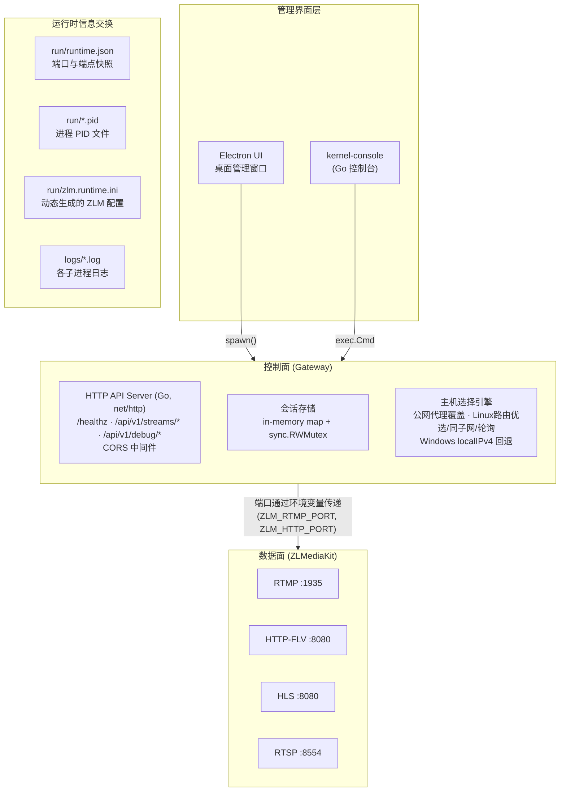

# 流媒体服务端整体架构图

```mermaid
flowchart TB
  subgraph MGMT["管理界面层"]
    direction LR
    E1["Electron UI<br/>桌面管理窗口"]
    E2["kernel-console<br/>(Go 控制台)"]
  end
  E1 -- "spawn()" --> GW
  E2 -- "exec.Cmd" --> GW
  subgraph GW["控制面 (Gateway)"]
    direction TB
    G1["HTTP API Server (Go, net/http)<br/>/healthz · /api/v1/streams/* · /api/v1/debug/*<br/>CORS 中间件"]
    G2["会话存储<br/>in-memory map + sync.RWMutex"]
    G3["主机选择引擎<br/>公网代理覆盖 · Linux路由优选/同子网/轮询<br/>Windows localIPv4 回退"]
  end
  GW -- "端口通过环境变量传递<br/>(ZLM_RTMP_PORT, ZLM_HTTP_PORT)" --> ZLM
  subgraph ZLM["数据面 (ZLMediaKit)"]
    direction LR
    Z1["RTMP :1935"]
    Z2["HTTP-FLV :8080"]
    Z3["HLS :8080"]
    Z4["RTSP :8554"]
  end
  subgraph RT["运行时信息交换"]
    direction LR
    R1["run/runtime.json<br/>端口与端点快照"]
    R2["run/*.pid<br/>进程 PID 文件"]
    R3["run/zlm.runtime.ini<br/>动态生成的 ZLM 配置"]
    R4["logs/*.log<br/>各子进程日志"]
  end
```
