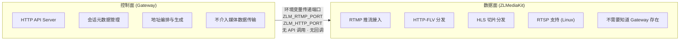

# 控制面与数据面分离架构图

```mermaid
flowchart LR
  subgraph CP["控制面 (Gateway)"]
    C1["HTTP API Server"]
    C2["会话元数据管理"]
    C3["地址编排与生成"]
    C4["不介入媒体数据传输"]
  end
  CP -- "环境变量传递端口<br/>ZLM_RTMP_PORT<br/>ZLM_HTTP_PORT<br/>无 API 调用 · 无回调" --> DP
  subgraph DP["数据面 (ZLMediaKit)"]
    D1["RTMP 推流接入"]
    D2["HTTP-FLV 分发"]
    D3["HLS 切片分发"]
    D4["RTSP 支持 (Linux)"]
    D5["不需要知道 Gateway 存在"]
  end
```
