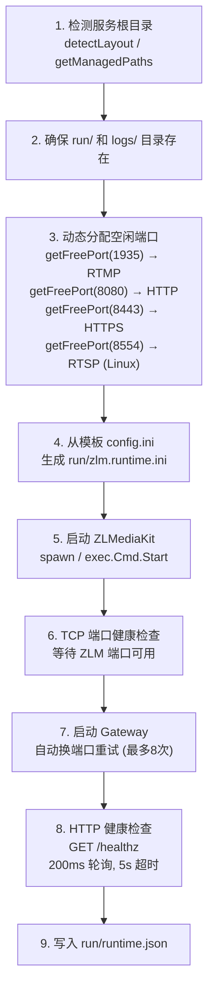

# 服务启动流程图

```mermaid
flowchart TB
  S1["1. 检测服务根目录<br/>detectLayout / getManagedPaths"] --> S2["2. 确保 run/ 和 logs/ 目录存在"]
  S2 --> S3["3. 动态分配空闲端口<br/>getFreePort(1935) → RTMP<br/>getFreePort(8080) → HTTP<br/>getFreePort(8443) → HTTPS<br/>getFreePort(8554) → RTSP (Linux)"]
  S3 --> S4["4. 从模板 config.ini<br/>生成 run/zlm.runtime.ini"]
  S4 --> S5["5. 启动 ZLMediaKit<br/>spawn / exec.Cmd.Start"]
  S5 --> S6["6. TCP 端口健康检查<br/>等待 ZLM 端口可用"]
  S6 --> S7["7. 启动 Gateway<br/>自动换端口重试 (最多8次)"]
  S7 --> S8["8. HTTP 健康检查<br/>GET /healthz<br/>200ms 轮询, 5s 超时"]
  S8 --> S9["9. 写入 run/runtime.json"]
```
