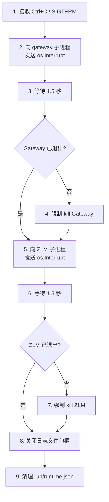

# 服务优雅停止流程图

```mermaid
flowchart TB
  S1["1. 接收 Ctrl+C / SIGTERM"] --> S2["2. 向 gateway 子进程<br/>发送 os.Interrupt"]
  S2 --> S3["3. 等待 1.5 秒"]
  S3 --> S4{"Gateway 已退出?"}
  S4 -- "否" --> S5["4. 强制 kill Gateway"]
  S4 -- "是" --> S6["5. 向 ZLM 子进程<br/>发送 os.Interrupt"]
  S5 --> S6
  S6 --> S7["6. 等待 1.5 秒"]
  S7 --> S8{"ZLM 已退出?"}
  S8 -- "否" --> S9["7. 强制 kill ZLM"]
  S8 -- "是" --> S10["8. 关闭日志文件句柄"]
  S9 --> S10
  S10 --> S11["9. 清理 run/runtime.json"]
```
