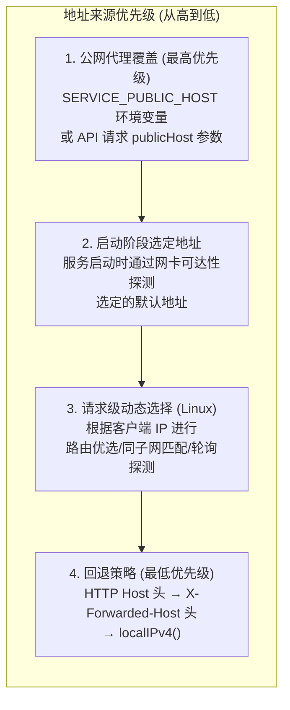

# 地址编排优先级图

```mermaid
flowchart TB
  subgraph PRIORITY["地址来源优先级 (从高到低)"]
    direction TB
    P1["1. 公网代理覆盖 (最高优先级)<br/>SERVICE_PUBLIC_HOST 环境变量<br/>或 API 请求 publicHost 参数"]
    P2["2. 启动阶段选定地址<br/>服务启动时通过网卡可达性探测<br/>选定的默认地址"]
    P3["3. 请求级动态选择 (Linux)<br/>根据客户端 IP 进行<br/>路由优选/同子网匹配/轮询探测"]
    P4["4. 回退策略 (最低优先级)<br/>HTTP Host 头 → X-Forwarded-Host 头<br/>→ localIPv4()"]
  end
  P1 --> P2 --> P3 --> P4
```
