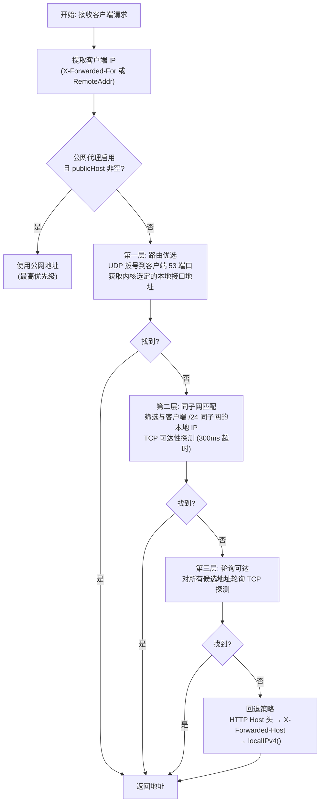

# Linux 多网卡选择算法图

```mermaid
flowchart TB
  START["开始: 接收客户端请求"] --> EXTRACT["提取客户端 IP<br/>(X-Forwarded-For 或 RemoteAddr)"]
  EXTRACT --> CHECK_PUBLIC{"公网代理启用<br/>且 publicHost 非空?"}
  CHECK_PUBLIC -- "是" --> PUBLIC["使用公网地址<br/>(最高优先级)"]
  CHECK_PUBLIC -- "否" --> L1["第一层: 路由优选<br/>UDP 拨号到客户端 53 端口<br/>获取内核选定的本地接口地址"]
  L1 --> L1_OK{"找到?"}
  L1_OK -- "是" --> DONE["返回地址"]
  L1_OK -- "否" --> L2["第二层: 同子网匹配<br/>筛选与客户端 /24 同子网的本地 IP<br/>TCP 可达性探测 (300ms 超时)"]
  L2 --> L2_OK{"找到?"}
  L2_OK -- "是" --> DONE
  L2_OK -- "否" --> L3["第三层: 轮询可达<br/>对所有候选地址轮询 TCP 探测"]
  L3 --> L3_OK{"找到?"}
  L3_OK -- "是" --> DONE
  L3_OK -- "否" --> FALLBACK["回退策略<br/>HTTP Host 头 → X-Forwarded-Host<br/>→ localIPv4()"]
  FALLBACK --> DONE
```
