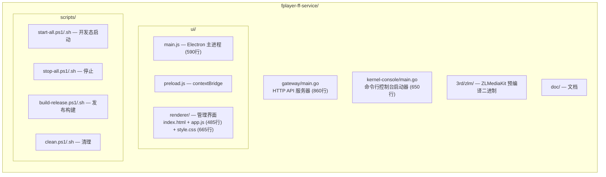

# Git 仓库交付结构图

```mermaid
flowchart TB
  subgraph REPO["fplayer-ff-service/"]
    direction TB
    G1["gateway/main.go<br/>HTTP API 服务器 (860行)"]
    G2["kernel-console/main.go<br/>命令行控制台启动器 (650行)"]
    subgraph UI["ui/"]
      U1["main.js — Electron 主进程 (590行)"]
      U2["preload.js — contextBridge"]
      U3["renderer/ — 管理界面<br/>index.html + app.js (485行) + style.css (665行)"]
    end
    subgraph SCRIPTS["scripts/"]
      S1["start-all.ps1/.sh — 开发态启动"]
      S2["stop-all.ps1/.sh — 停止"]
      S3["build-release.ps1/.sh — 发布构建"]
      S4["clean.ps1/.sh — 清理"]
    end
    G5["3rd/zlm/ — ZLMediaKit 预编译二进制"]
    G6["doc/ — 文档"]
  end
```
