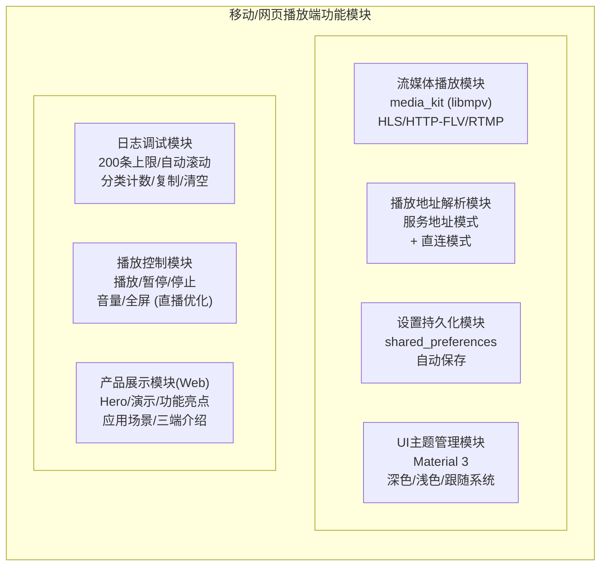

# 移动/网页播放端功能模块总览图

```mermaid
flowchart TB
  subgraph MOD["移动/网页播放端功能模块"]
    direction TB
    subgraph ROW1[" "]
      direction LR
      M1["流媒体播放模块<br/>media_kit (libmpv)<br/>HLS/HTTP-FLV/RTMP"]
      M2["播放地址解析模块<br/>服务地址模式<br/>+ 直连模式"]
      M3["设置持久化模块<br/>shared_preferences<br/>自动保存"]
      M4["UI主题管理模块<br/>Material 3<br/>深色/浅色/跟随系统"]
    end
    subgraph ROW2[" "]
      direction LR
      M5["日志调试模块<br/>200条上限/自动滚动<br/>分类计数/复制/清空"]
      M6["播放控制模块<br/>播放/暂停/停止<br/>音量/全屏 (直播优化)"]
      M7["产品展示模块(Web)<br/>Hero/演示/功能亮点<br/>应用场景/三端介绍"]
    end
  end
```
