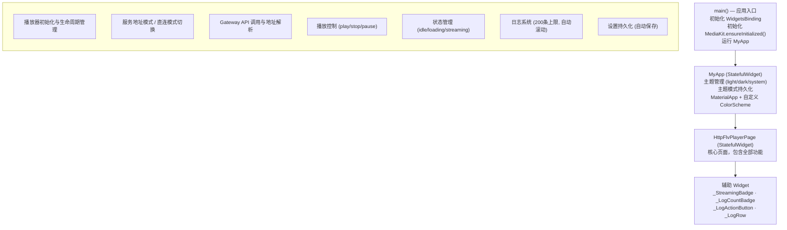

# 移动端架构图

```mermaid
flowchart TB
  MAIN["main() — 应用入口<br/>初始化 WidgetsBinding<br/>初始化 MediaKit.ensureInitialized()<br/>运行 MyApp"]
  MAIN --> MYAPP["MyApp (StatefulWidget)<br/>主题管理 (light/dark/system)<br/>主题模式持久化<br/>MaterialApp + 自定义 ColorScheme"]
  MYAPP --> PAGE["HttpFlvPlayerPage (StatefulWidget)<br/>核心页面，包含全部功能"]
  subgraph PAGE_DETAIL[" "]
    direction TB
    P1["播放器初始化与生命周期管理"]
    P2["服务地址模式 / 直连模式切换"]
    P3["Gateway API 调用与地址解析"]
    P4["播放控制 (play/stop/pause)"]
    P5["状态管理 (idle/loading/streaming)"]
    P6["日志系统 (200条上限, 自动滚动)"]
    P7["设置持久化 (自动保存)"]
  end
  PAGE --> WIDGETS["辅助 Widget<br/>_StreamingBadge · _LogCountBadge<br/>_LogActionButton · _LogRow"]
```
