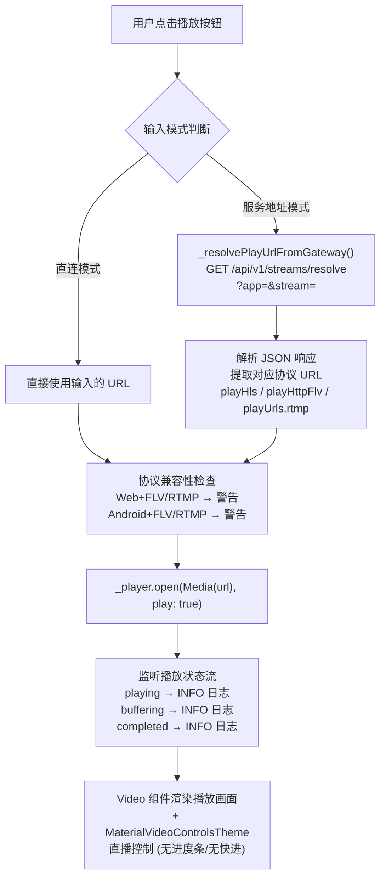

# 移动端播放流程图

```mermaid
flowchart TB
  START["用户点击播放按钮"] --> MODE{"输入模式判断"}
  MODE -- "服务地址模式" --> RESOLVE["_resolvePlayUrlFromGateway()<br/>GET /api/v1/streams/resolve<br/>?app=&stream="]
  MODE -- "直连模式" --> DIRECT["直接使用输入的 URL"]
  RESOLVE --> PARSE["解析 JSON 响应<br/>提取对应协议 URL<br/>playHls / playHttpFlv / playUrls.rtmp"]
  DIRECT --> CHECK
  PARSE --> CHECK["协议兼容性检查<br/>Web+FLV/RTMP → 警告<br/>Android+FLV/RTMP → 警告"]
  CHECK --> OPEN["_player.open(Media(url), play: true)"]
  OPEN --> LISTEN["监听播放状态流<br/>playing → INFO 日志<br/>buffering → INFO 日志<br/>completed → INFO 日志"]
  LISTEN --> RENDER["Video 组件渲染播放画面<br/>+ MaterialVideoControlsTheme<br/>直播控制 (无进度条/无快进)"]
```
