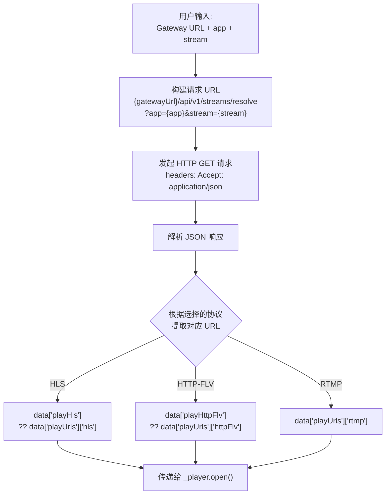

# 播放地址解析流程图

```mermaid
flowchart TB
  INPUT["用户输入:<br/>Gateway URL + app + stream"] --> BUILD["构建请求 URL<br/>{gatewayUrl}/api/v1/streams/resolve<br/>?app={app}&stream={stream}"]
  BUILD --> SEND["发起 HTTP GET 请求<br/>headers: Accept: application/json"]
  SEND --> PARSE["解析 JSON 响应"]
  PARSE --> EXTRACT{"根据选择的协议<br/>提取对应 URL"}
  EXTRACT -- "HLS" --> HLS["data['playHls']<br/>?? data['playUrls']['hls']"]
  EXTRACT -- "HTTP-FLV" --> FLV["data['playHttpFlv']<br/>?? data['playUrls']['httpFlv']"]
  EXTRACT -- "RTMP" --> RTMP["data['playUrls']['rtmp']"]
  HLS --> PLAY["传递给 _player.open()"]
  FLV --> PLAY
  RTMP --> PLAY
```
