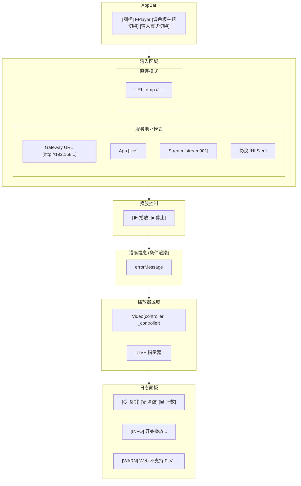

# 移动端 UI 布局设计图

```mermaid
flowchart TB
  subgraph APPBAR["AppBar"]
    A1["[图标] FPlayer [调色板主题切换] [输入模式切换]"]
  end
  subgraph INPUT["输入区域"]
    subgraph SERVICE["服务地址模式"]
      S1["Gateway URL [http://192.168...]"]
      S2["App [live]"]
      S3["Stream [stream001]"]
      S4["协议 [HLS ▼]"]
    end
    subgraph DIRECT_MODE["直连模式"]
      D1["URL [rtmp://...]"]
    end
  end
  subgraph CONTROLS["播放控制"]
    C1["[▶ 播放] [⏹ 停止]"]
  end
  subgraph ERROR["错误信息 (条件渲染)"]
    E1["errorMessage"]
  end
  subgraph PLAYER["播放器区域"]
    P1["Video(controller: _controller)"]
    P2["[LIVE 指示器]"]
  end
  subgraph LOG["日志面板"]
    L1["[📋 复制] [🗑 清空] [📊 计数]"]
    L2["[INFO] 开始播放..."]
    L3["[WARN] Web 不支持 FLV..."]
  end
  APPBAR --> INPUT --> CONTROLS --> ERROR --> PLAYER --> LOG
```
