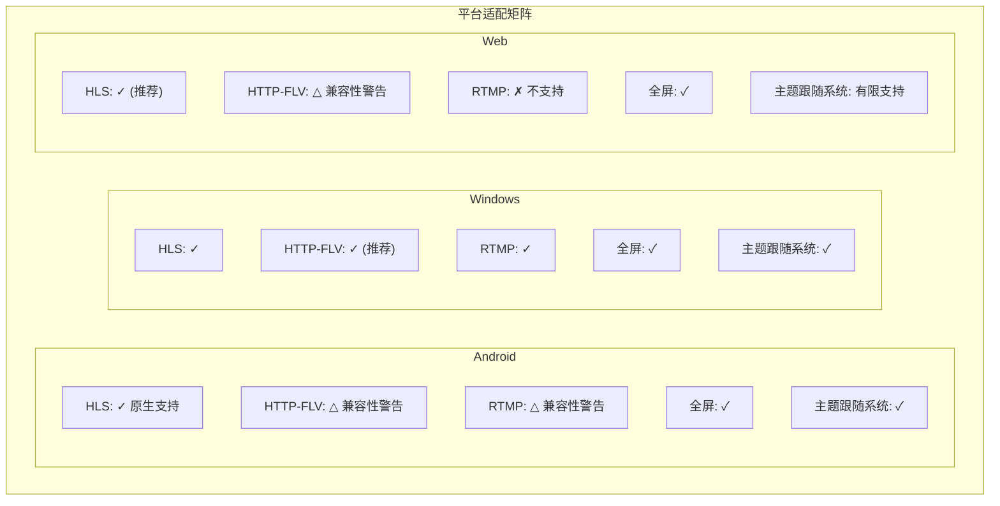

# 平台适配对比图

```mermaid
flowchart TB
  subgraph PLATFORM["平台适配矩阵"]
    subgraph ANDROID["Android"]
      A1["HLS: ✓ 原生支持"]
      A2["HTTP-FLV: △ 兼容性警告"]
      A3["RTMP: △ 兼容性警告"]
      A4["全屏: ✓"]
      A5["主题跟随系统: ✓"]
    end
    subgraph WINDOWS["Windows"]
      W1["HLS: ✓"]
      W2["HTTP-FLV: ✓ (推荐)"]
      W3["RTMP: ✓"]
      W4["全屏: ✓"]
      W5["主题跟随系统: ✓"]
    end
    subgraph WEB["Web"]
      WB1["HLS: ✓ (推荐)"]
      WB2["HTTP-FLV: △ 兼容性警告"]
      WB3["RTMP: ✗ 不支持"]
      WB4["全屏: ✓"]
      WB5["主题跟随系统: 有限支持"]
    end
  end
```
