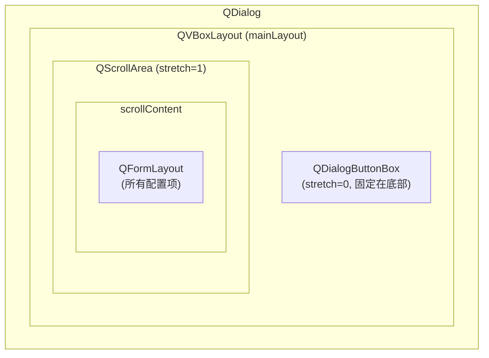
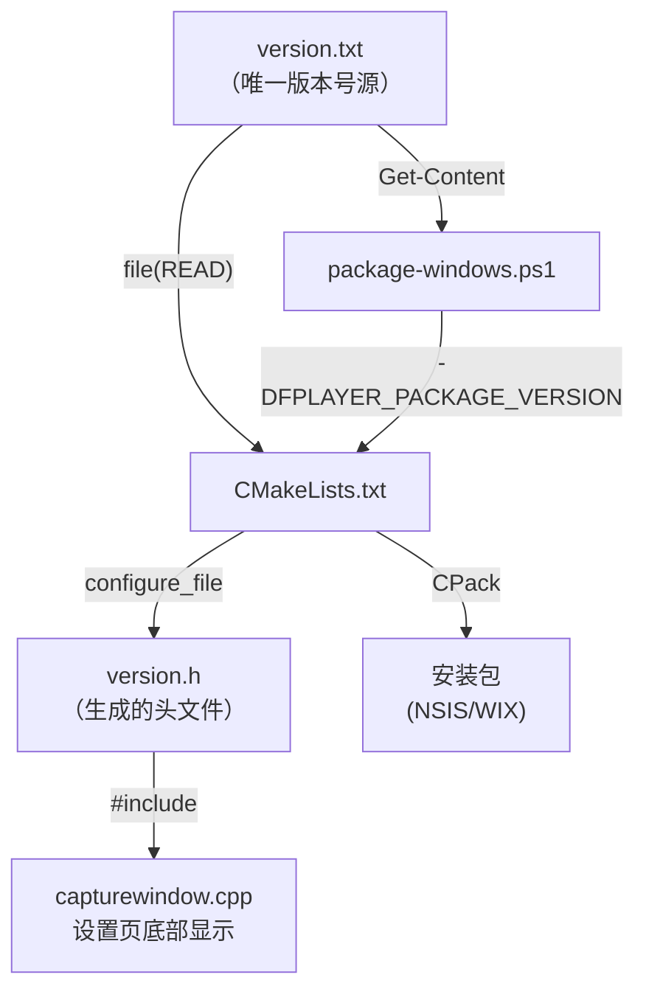

# 弹窗滚动条、滚轮拦截与版本号统一管理

## 概述

本次改进包含三个部分：

1. **弹窗滚动条** — 为系统设置、推流、拉流三个配置窗口添加滚动区域
2. **下拉框滚轮拦截** — 全局禁用 QComboBox 鼠标滚轮切换选项
3. **版本号统一管理** — 以 `version.txt` 为唯一来源，CMake / C++ / 打包脚本均从此读取

---

## 一、弹窗滚动条与最小尺寸

### 问题

设置页面、推拉流配置页面的内容过多，高度固定且无滚动条。在小分辨率显示器（如 1366×768）下，对话框底部按钮被截断，无法操作。

### 方案

为三个对话框的 `QFormLayout` 外套一层 `QScrollArea`，按钮固定在底部不参与滚动。



### 涉及文件

[widget/src/capturewindow.cpp](../widget/src/capturewindow.cpp)

| 对话框 | 位置 | 最小尺寸 | 高度上限 |
|---|---|---|---|
| 推流配置 | `actionPushStream` 触发 | 640×400 | 屏幕高度 - 60 |
| 拉流配置窗口 | `actionPullStream` 触发 | 640×400 | 屏幕高度 - 60 |
| 系统设置 | `openCaptureSettingsDialog()` | 640×400 | 屏幕高度 - 80 |

### 关键参数

```cpp
scrollArea->setWidgetResizable(true);                          // 内容自适应宽度
scrollArea->setHorizontalScrollBarPolicy(Qt::ScrollBarAlwaysOff); // 禁用横向滚动
scrollArea->setFrameShape(QFrame::NoFrame);                    // 无边框，视觉融合
mainLayout->addWidget(scrollArea, 1);  // stretch=1，占据剩余空间
mainLayout->addWidget(buttons, 0);     // stretch=0，固定在底部
```

---

## 二、全局禁用下拉框滚轮切换

### 问题

在配置对话框中，鼠标滚轮划过 `QComboBox` 时会意外切换选项值。添加 `QScrollArea` 后这个问题更加突出——用户期望滚轮用于滚动页面，但被下拉框截获。

### 方案

在 `QApplication` 上安装全局事件过滤器，拦截所有 `QComboBox` 的 `QEvent::Wheel` 事件。

### 涉及文件

[app/main.cpp](../app/main.cpp)

```cpp
class ComboBoxWheelBlocker : public QObject
{
public:
    using QObject::QObject;
    bool eventFilter(QObject* obj, QEvent* event) override
    {
        if (event->type() == QEvent::Wheel && qobject_cast<QComboBox*>(obj))
            return true;  // 吃掉滚轮事件
        return QObject::eventFilter(obj, event);
    }
};

// main() 中：
app.installEventFilter(new ComboBoxWheelBlocker(&app));
```

### 注意事项

- 下拉列表 **展开时**，滚轮事件目标是 popup 的 `QAbstractItemView`，不会被拦截，列表内仍可正常滚动
- 该过滤器覆盖 **整个应用** 中的所有 `QComboBox`，无需逐个设置

---

## 三、版本号统一管理

### 问题

之前版本号散落在多处：

- `CMakeLists.txt` → `set(FPLAYER_PACKAGE_VERSION "0.1.0" ...)`
- `scripts/package-windows.ps1` → `-Version` 参数
- 每次发版需要改两个地方，且通过 CMake 编译定义修改会导致全量重编译

### 方案



### 涉及文件

| 文件 | 角色 |
|---|---|
| [version.txt](../version.txt) | **唯一版本号源**，内容如 `0.3.7` |
| [CMakeLists.txt](../CMakeLists.txt) | 读取 `version.txt`，`configure_file` 生成头文件 |
| [common/CMakeLists.txt](../common/CMakeLists.txt) | 添加 `${CMAKE_BINARY_DIR}/generated` 到 include 路径 |
| [common/include/fplayer/common/version.h.in](../common/include/fplayer/common/version.h.in) | 模板文件，`@FPLAYER_PACKAGE_VERSION@` 占位 |
| [widget/src/capturewindow.cpp](../widget/src/capturewindow.cpp) | `#include <fplayer/common/version.h>`，设置页底部显示 |
| [scripts/package-windows.ps1](../scripts/package-windows.ps1) | `-Version` 未指定时自动从 `version.txt` 读取 |

### CMake 关键逻辑

```cmake
# 1. 从 version.txt 读取（同时配置依赖，文件变更自动触发 cmake 重跑）
set(_version_txt "${CMAKE_SOURCE_DIR}/version.txt")
set_property(DIRECTORY APPEND PROPERTY CMAKE_CONFIGURE_DEPENDS "${_version_txt}")
if(EXISTS "${_version_txt}")
  file(READ "${_version_txt}" _version_raw)
  string(STRIP "${_version_raw}" FPLAYER_PACKAGE_VERSION)
endif()

# 2. 生成头文件（只有 include 它的源文件会重编译，而非整个项目）
configure_file(
  "${CMAKE_SOURCE_DIR}/common/include/fplayer/common/version.h.in"
  "${CMAKE_BINARY_DIR}/generated/fplayer/common/version.h"
)
```

### 编译效率对比

| 方式 | 改版本号后 | 原理 |
|---|---|---|
| ~~`add_compile_definitions`~~ | 全量重编译 | 编译命令变化，所有 translation unit 失效 |
| `configure_file` + 头文件 | **仅 `capturewindow.cpp` 重编译** | 生成文件时间戳变化，仅依赖它的文件重编译 |

### 使用方式

```bash
# 日常开发：改 version.txt → ninja（自动触发 cmake 重配置 + 增量编译）
echo "0.4.0" > version.txt
ninja

# 打包（自动读取 version.txt）：
.\scripts\package-windows.ps1 -Qt6Dir "..." -CMakePrefixPath "..."

# 打包（手动覆盖版本号）：
.\scripts\package-windows.ps1 -Version "1.0.0-rc1" -Qt6Dir "..." -CMakePrefixPath "..."
```
